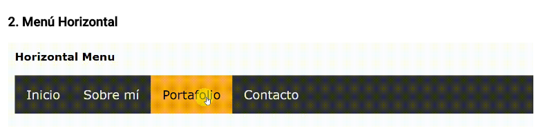

## Menú Horizontal

### Objetivo Funcional

Creación de un menú como en la siguiente imagen:

### Objetivo Tecnico

Poner en practica el ejercicio de menú horizontal aplicando nuestros conocimientos en pseudo clase.

### Herramientas

+ Editor Visual Studio Code
    + HTML5
    + CSS3

